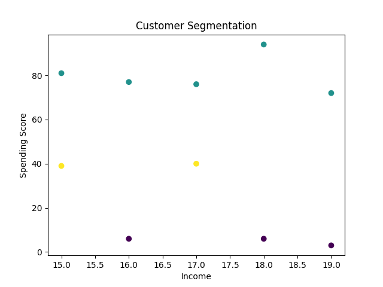

# Customer Segmentation using K-Means Clustering

## Overview

Customer segmentation is an important technique used by businesses to understand customer behavior.
This project demonstrates how machine learning can be used to group customers based on their **Income** and **Spending Score**.

Using clustering techniques, customers are divided into distinct segments that help businesses identify high-value customers and design targeted marketing strategies.

---

## Technologies Used

* Python
* Pandas
* Matplotlib
* Scikit-learn
* Jupyter Notebook

---

## Machine Learning Technique

This project uses the **K-Means Clustering algorithm**, an unsupervised machine learning method that groups data points based on similarity.

The algorithm identifies patterns in customer spending behavior and divides them into clusters.

---

## Dataset

The dataset used in this project contains customer information such as:

* Customer ID
* Age
* Annual Income
* Spending Score

These features are used to identify spending patterns among different customer groups.

---

## Project Workflow

1. Import required Python libraries
2. Load and explore customer data
3. Visualize customer spending patterns
4. Apply K-Means clustering algorithm
5. Generate customer segments
6. Visualize clusters using scatter plots

---

## Output Visualization

The scatter plot below shows the customer segments generated by the clustering algorithm.

Each color represents a different customer segment.

---

## Key Insights

* Customers can be divided into different behavioral groups.
* Some customers have **high income but low spending**, while others have **high spending patterns**.
* These insights can help businesses create targeted marketing strategies.

---

## Future Improvements

* Use larger real-world datasets
* Apply advanced clustering techniques
* Build an interactive dashboard for customer segmentation analysis

---

## Author

Vishal Raj
Data Analytics & AI/ML Enthusiast
Python | Power BI | Machine Learning | Data Analytics

